# 🚌 SmartBus: Online Bus Ticket Booking System

A web-based application built using **ASP.NET Core MVC** that allows users to search, view, and book bus tickets, while giving admins the tools to manage buses and users effectively.

---

## 📚 Table of Contents

- [🚀 Features](#-features)
- [🛠️ Tech Stack](#️-tech-stack)
- [📂 Project Structure](#-project-structure)
- [📸 Screenshots (Optional)](#-screenshots)
- [🧑‍💻 How to Run](#-how-to-run)
- [🤝 Contributors](#-contributors)
- [📄 License](#-license)

---

## 🚀 Features

### 🔐 Authentication
- Admin login and logout functionality
- User login, registration, and session management

### 🧑‍💼 Admin Dashboard
- View total number of buses and users
- Add new buses with:
  - Name, model, departure time, route (start & end points), and price
  - Seat map generation and storage
- Edit and update existing bus information
- Delete a bus record
- View all registered users

### 🚌 Bus Management
- Display a list of all buses
- Edit or delete bus details
- Modal form to quickly add new buses from the dashboard

### 👥 User Management
- Display all registered users with details:
  - Full name, email, phone, and username

### 🎟️ Ticket Booking
- Search buses by route (starting and ending points)
- View bus seat layout and availability
- Book seats with live availability check
- Store ticket details:
  - User, bus, seat number, booking date, and price

---

## 🛠️ Tech Stack

- **ASP.NET Core MVC**
- **Entity Framework Core**
- **SQL Server (via EF)**
- **Bootstrap 5**
- **Session Management** for authentication
- **Razor Views** for UI
- **C#**

---

## 📂 Project Structure

- `Controllers/` – Business logic and routing (Admin, Bus, Account)
- `Models/` – Entity classes (Bus, User, Ticket)
- `Views/` – Razor pages for UI rendering
- `Data/` – EF DbContext and migrations
- `wwwroot/` – Static files like CSS, JS

---

## 📸 Screenshots

### Home Page
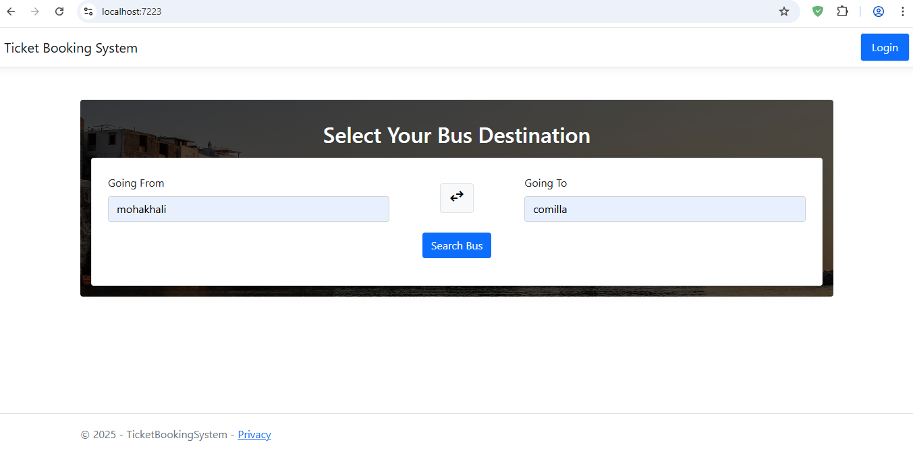
### Search Result

### 🧑‍💼 User Account
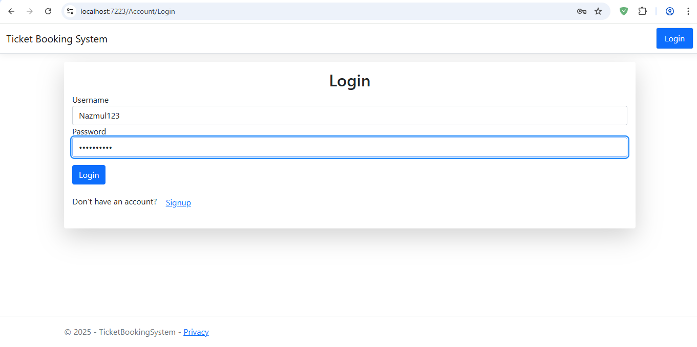
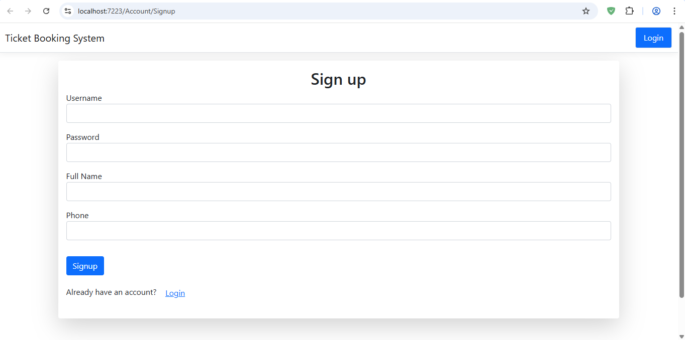

### 🧑‍💼 User Dashboard

### 🧑‍💼 User Buying ticket
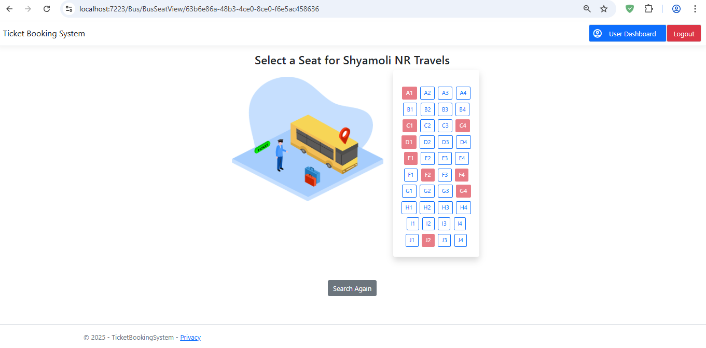
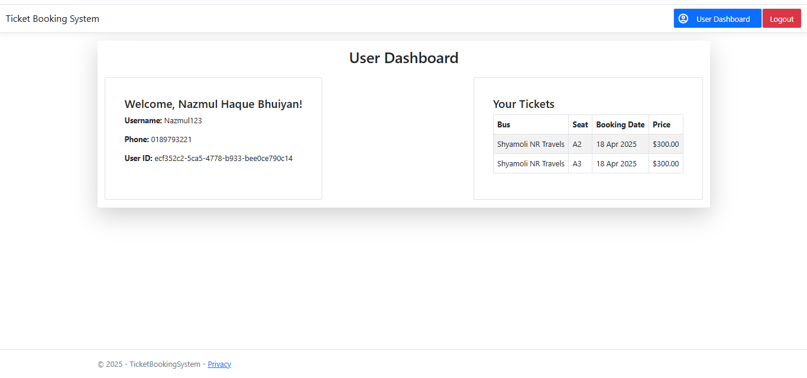
### 🧑‍💼 Admin Account
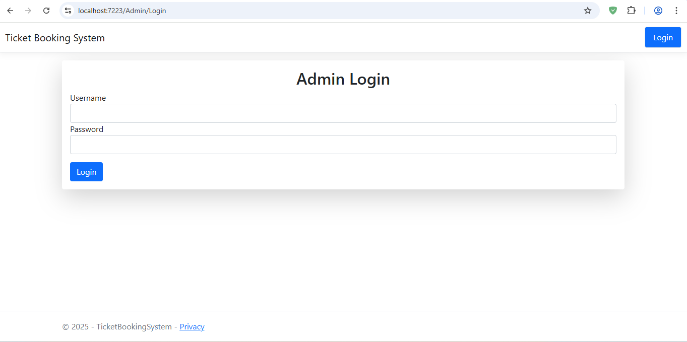
### 🧑‍💼 Admin Dashboard
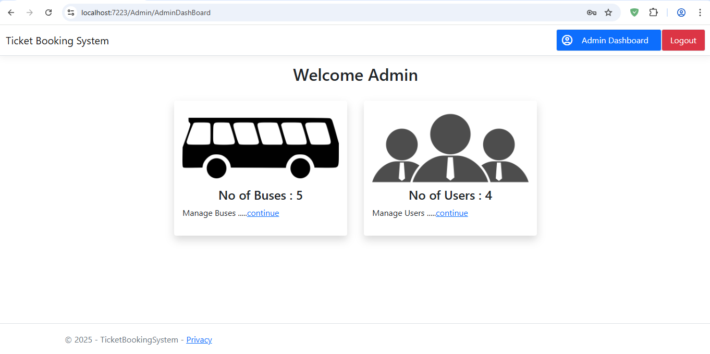
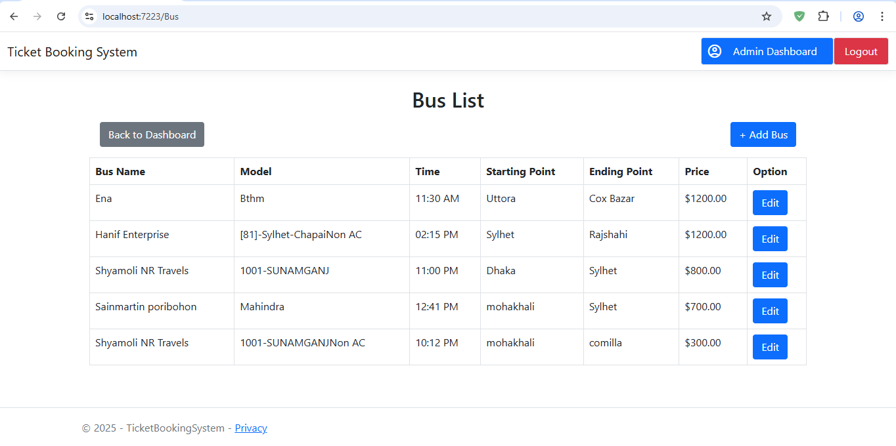
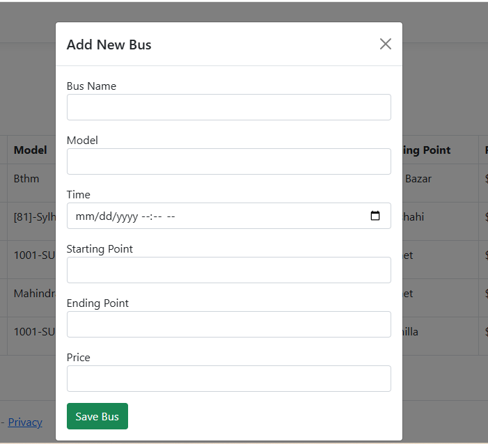
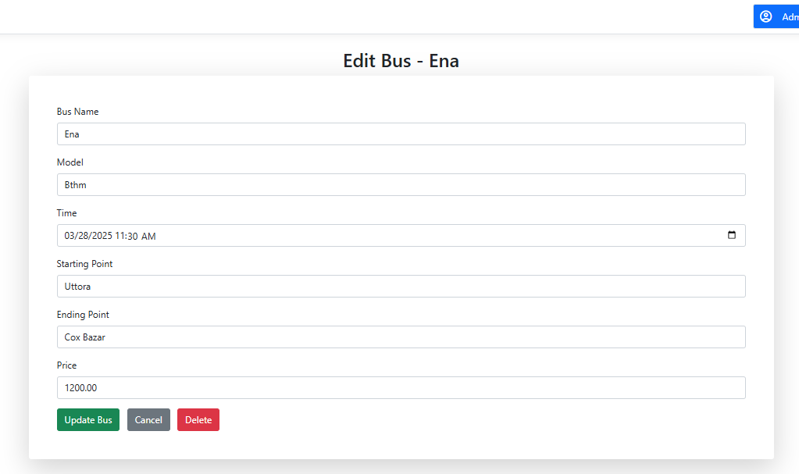
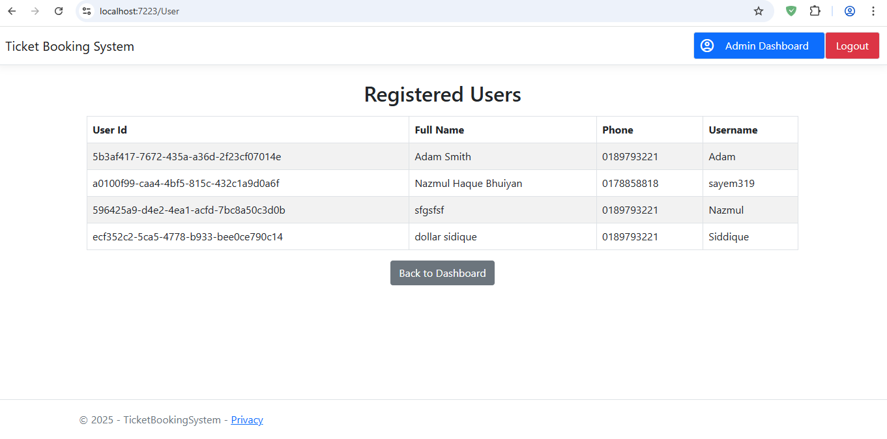

---

## 🧑‍💻 How to Run

1. Clone the repository
2. Open in Visual Studio
3. Configure your connection string in `appsettings.json`
4. Run `Update-Database` to apply migrations
5. Start debugging (F5)

---

## 🤝 Contributors

- Md Nazmul Haque Bhuiyan

---

## 📄 License

This project is licensed under the MIT License - see the [LICENSE](LICENSE) file for details.
